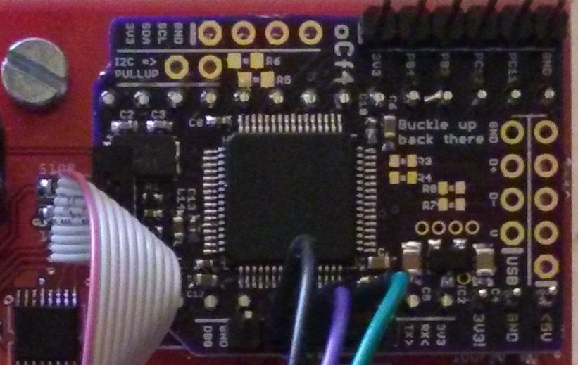

# OC + F4
For grins I made an F405-based Teensy replacement for [o\_C](https://github.com/patrickdowling/O_C).

It seemed like a good idea at the time and was an "excuse" to add F4 support to my F0 framework which then became
[stm32x](https://github.com/patrickdowling/stm32x).

The four-layer board is pretty tightly packed and tried to include everything and the kitchen sink (I2C, serial/MIDI, USB header...). There's even space for an SPI flash chip on the bottom... It should also be noted that I'm really just winging it when it comes to hardware design.

The single point of annoyance (the shared SPI between the DAC and screen) however remains although it is possible to run the thing at closer to 30KHz here (the Teensy 3.2 on `o_C` was effectively maxxing out at 16.6KHz with the 30MHz SPI).

Utlimately though, once the base drivers (ADC/TR/DAC/screen) were working it didn't actually have a purpose so there's very little actual functionality. Except a very early draft of what might be a "better" framework. So here it is anyway, warts
and all.

If someone does want to pursue this further, let me know.
